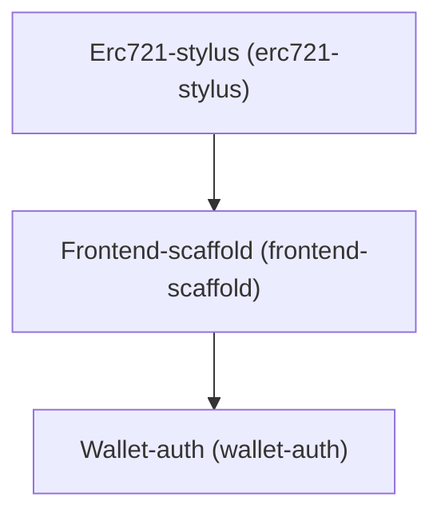

# Architecture

## Dependency Graph

```mermaid
graph TD
  36187e84["Erc721-stylus (erc721-stylus)"]
  43cdf920["Frontend-scaffold (frontend-scaffold)"]
  b7c0bb57["Wallet-auth (wallet-auth)"]
  36187e84 --> 43cdf920
  43cdf920 --> b7c0bb57
```

## Execution / Implementation Order

1. **Erc721-stylus** (`36187e84`)
2. **Frontend-scaffold** (`43cdf920`)
3. **Wallet-auth** (`b7c0bb57`)
